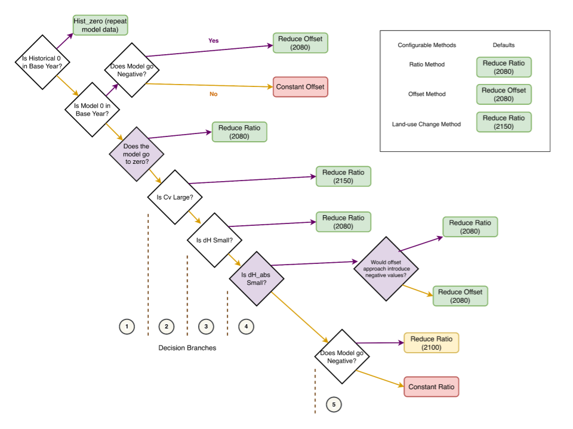

.. theory_:

Theory
******

Methods
~~~~~~~

All harmonization is based on the following equations.

:math:`\beta`: the harmonization convergence parameter

.. math::

    \begin{equation}\label{eqs:factor}
      \beta(t, t_i, t_f) =
      \begin{cases}
        1 - \frac{t - t_i}{t_f - t_i},& \text{if } t \leq t_f\\
        0,                        & \text{otherwise}
      \end{cases}
    \end{equation}

:math:`m^{rat}`: ratio-based harmoniation

.. math::

    \begin{equation}\label{eqs:ratio}
      m^{rat}(t, m, h, t_i, t_f) = [\beta(t, t_i, t_f) (\frac{h(t_i)}{m(t_i)} - 1) + 1] m(t)
    \end{equation}

:math:`m^{off}`: offset-based harmoniation

.. math::

    \begin{equation}\label{eqs:offset}
      m^{off}(t, m, h, t_i, t_f) = \beta(t, t_i, t_f) (h(t_i) - m(t_i)) + m(t)
    \end{equation}

:math:`m^{int}`: linear-interoplation-based harmoniation

.. math::

    \begin{equation}\label{eqs:interpolate}
      m^{int}(t, m, h, t_i, t_f) =
      \begin{cases}
        \frac{m(t_f) - h(t_i)}{t_f - t_i}(t - t_i) + h(t_i), & \text{if } t \leq t_f\\
        m(t), & \text{otherwise}
      \end{cases}
    \end{equation}

These harmonization methods are made available in :code:`aneris` by name
selection. Available names are listed below:

.. list-table:: All Harmonization Methods Provided in :code:`aneris`
   :header-rows: 1

   * - Method Name
     - Harmonization Family
     - Convergence Year
   * - :code:`constant_ratio`
     - ratio
     - :math:`t_f = \infty`
   * - :code:`reduce_ratio_<year>`
     - ratio
     - :math:`t_f = \texttt{<year>}`
   * - :code:`constant_offset`
     - offset
     - :math:`t_f = \infty`
   * - :code:`reduce_offset_<year>`
     - offset
     - :math:`t_f = \texttt{<year>}`
   * - :code:`linear_inerpolate_<year>`
     - interpolation
     - :math:`t_f = \texttt{<year>}`

Default Decision Tree
~~~~~~~~~~~~~~~~~~~~~

While any method can be used to harmonize a given trajectory, intelligent
defaults are made available to the user. These default methods are determined
by use of a *decision tree*, which analyzes the historical trajectory, model
trajectory, and relative difference between trajectories in the harmonization
year. The decision tree as implemented is provided below:

    The decision tree use in :code:`aneris` to determine default methods to use
    for each trajectory.
